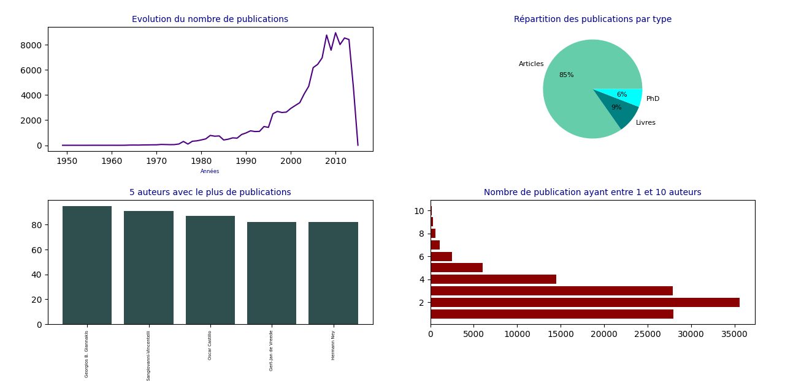
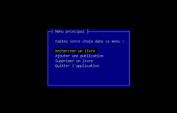
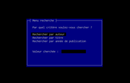

Une bibliothèque MongoDB avec Python
==========
Utilisation de Pymongo pour requêter une librairie MongoDB et de NCurses pour plus d'ergonomie dans l'invite de commande.
Ecriture d'un programme Python en POO permettant de réaliser des requêtes pymongo et des visualisations.
La base de donnée MongoDB utilisée est une librairie contenant des livres, articles etc.
Utilisation de pandas et Matplotlib pour réaliser des graphiques afin de visualiser les données de la base.

Fig1: Représentation graphique des données de la librairie

<table>
<tr>
<td></td>
<td></td>
</tr>
<tr>
<td>Fig2: Exemple d'écran NCurses </td>
<td>Fig3: Exemple d'écran NCurses </td>
</tr>
</table>
